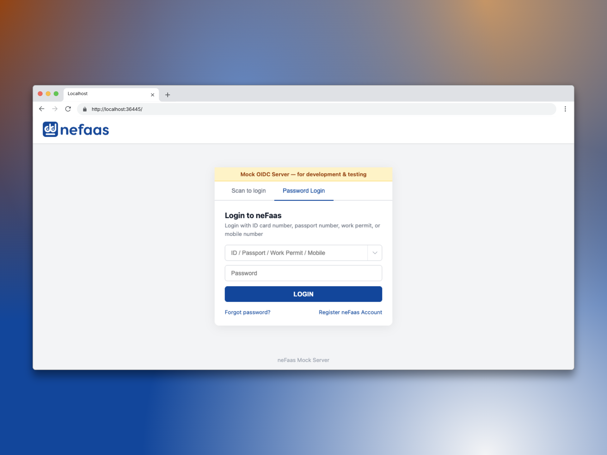

# neFaas Mock OIDC Server

A mock OIDC server that works like the [eFaas](https://efaas.gov.mv) (Maldives National SSO) developer environment. Use it locally or in CI as a drop-in replacement for the real eFaas dev server — same endpoints, scopes, claims, and authorization flows.



## Quick Start

```bash
docker run -p 36445:36445 ghcr.io/ayarse/mock-efaas-server
```

Server starts at `http://localhost:36445`. Configure with environment variables:

```bash
docker run -p 9000:9000 -e PORT=9000 -e HOST=0.0.0.0 ghcr.io/ayarse/mock-efaas-server
```

### From source

```bash
bun install
bun src/index.ts
```

Or build the image locally:

```bash
docker build -t nefaas .
docker run -p 36445:36445 nefaas
```

## Endpoints

| Endpoint                            | Method   | Description                        |
| ----------------------------------- | -------- | ---------------------------------- |
| `/.well-known/openid-configuration` | GET      | OIDC Discovery Document            |
| `/.well-known/openid-configuration/jwks` | GET | JSON Web Key Set                   |
| `/connect/authorize`                | GET      | Authorization (redirects to login) |
| `/connect/token`                    | POST     | Token exchange                     |
| `/connect/userinfo`                 | GET      | User info claims                   |
| `/connect/endsession`               | GET      | Logout / end session               |
| `/connect/revocation`               | POST     | Token revocation                   |
| `/connect/introspect`               | POST     | Token introspection                |
| `/efaas/Account/Login`              | GET/POST | Login page UI                      |
| `/api/user/photo/:sub`              | GET      | Mock user photo                    |

## Authorization Flows

Supports hybrid, authorization code + PKCE, implicit (legacy), client credentials, refresh token, and one-tap login flows. See [docs/FLOWS.md](docs/FLOWS.md) for detailed sequence diagrams.

## Scopes & Claims

| Scope                      | Claims                                                                                                                                                                                                                         |
| -------------------------- | ------------------------------------------------------------------------------------------------------------------------------------------------------------------------------------------------------------------------------ |
| `openid`                   | `sub`                                                                                                                                                                                                                          |
| `efaas.profile`            | `first_name`, `middle_name`, `last_name`, `first_name_dhivehi`, `middle_name_dhivehi`, `last_name_dhivehi`, `gender`, `idnumber`, `verified`, `verification_type`, `last_verified_date`, `user_type_description`, `updated_at` |
| `efaas.email`              | `email`                                                                                                                                                                                                                        |
| `efaas.mobile`             | `mobile`, `country_dialing_code`                                                                                                                                                                                               |
| `efaas.birthdate`          | `birthdate`                                                                                                                                                                                                                    |
| `efaas.photo`              | `photo`                                                                                                                                                                                                                        |
| `efaas.work_permit_status` | `is_workpermit_active`                                                                                                                                                                                                         |
| `efaas.passport_number`    | `passport`                                                                                                                                                                                                                     |
| `efaas.country`            | `country_name`, `country_code`, `country_code_alpha3`, `country_dialing_code`                                                                                                                                                  |
| `efaas.permanent_address`  | `permanent_address` (JSON string)                                                                                                                                                                                              |
| `offline_access`           | Enables refresh tokens                                                                                                                                                                                                         |
| `profile`                  | Legacy alias for `efaas.profile`                                                                                                                                                                                               |

## Mock Users

The login page shows selectable mock users (see `src/data/users.json`). Any unrecognized input defaults to the first user. Default login password: `@123456` (configurable via `MOCK_PASSWORD`).

To load custom users, create a JSON file matching the same schema and pass its path:

```bash
USERS_FILE=./my-users.json bun src/index.ts
```

## Integration Example

Point your OIDC client library at the mock server. A default client is pre-registered:

```
Authority / Issuer:  http://localhost:36445
Discovery URL:       http://localhost:36445/.well-known/openid-configuration
Client ID:           mock-efaas-client
Client Secret:       mock-efaas-secret
Redirect URI:        http://localhost:3000/callback  (any URI is accepted)
Login Password:      @123456
```

## Customization

### Register additional clients

Register clients at runtime via the mock admin API:

```bash
curl -X POST http://localhost:36445/mock/clients \
  -H "Content-Type: application/json" \
  -d '{
    "client_id": "my-app",
    "client_secret": "my-secret",
    "client_type": "server_side",
    "redirect_uris": ["http://localhost:3000/callback"],
    "post_logout_redirect_uris": ["http://localhost:3000"],
    "backchannel_logout_uri": null,
    "frontchannel_logout_uri": null,
    "allowed_scopes": ["openid", "efaas.profile", "efaas.email"],
    "allowed_grant_types": ["authorization_code", "refresh_token"],
    "allow_offline_access": true
  }'
```

Or pre-load clients from a JSON file on startup:

```bash
CLIENTS_FILE=./my-clients.json bun src/index.ts
```

The file should be a JSON array of client objects (same shape as the `POST /mock/clients` body above).

### Environment variables

| Variable       | Default      | Description                                         |
| -------------- | ------------ | --------------------------------------------------- |
| `PORT`         | `36445`      | Server port                                         |
| `HOST`         | `localhost`  | Server listen address                                |
| `BASE_URL`     | (derived)    | Public-facing base URL (defaults to `http://HOST:PORT`) |
| `MOCK_PASSWORD`| `@123456`    | Password for the login page                         |
| `USERS_FILE`   | (none)       | Path to a custom users JSON file                    |
| `CLIENTS_FILE` | (none)       | Path to a custom clients JSON file                  |
