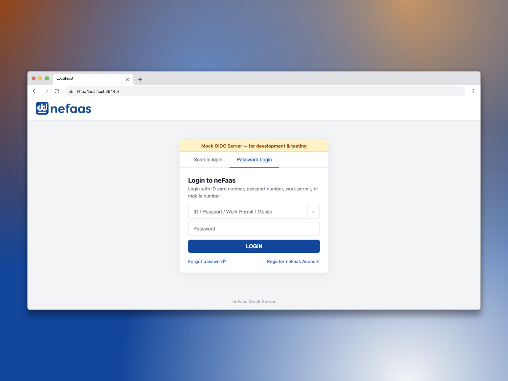

# neFaas Mock OIDC Server

A mock OIDC server that works like the [eFaas](https://efaas.gov.mv) (Maldives National SSO) developer environment. Use it locally or in CI as a drop-in replacement for the real eFaas dev server — same endpoints, scopes, claims, and authorization flows.



## Quick Start

```bash
docker run -p 36445:36445 ghcr.io/ayarse/mock-efaas-server
```

Server starts at `http://localhost:36445`. No configuration is needed: open it in a browser to manage clients, users and settings. Everything you change is saved to `.nefaas/state.json` (a Docker volume in the image), including the signing key, so tokens stay valid across restarts.

To keep state when the container is recreated, name the volume:

```bash
docker run -p 36445:36445 -v nefaas:/app/.nefaas ghcr.io/ayarse/mock-efaas-server
```

### From source

```bash
bun install
bun src/index.ts
```

Or build the image locally:

```bash
docker build -t nefaas .
docker run -p 36445:36445 nefaas
```

## Endpoints

| Endpoint                            | Method   | Description                        |
| ----------------------------------- | -------- | ---------------------------------- |
| `/.well-known/openid-configuration` | GET      | OIDC Discovery Document            |
| `/.well-known/openid-configuration/jwks` | GET | JSON Web Key Set                   |
| `/connect/authorize`                | GET      | Authorization (redirects to login) |
| `/connect/token`                    | POST     | Token exchange                     |
| `/connect/userinfo`                 | GET      | User info claims                   |
| `/connect/endsession`               | GET      | Logout / end session + single sign-out |
| `/connect/checksession`             | GET      | OIDC session-management iframe     |
| `/connect/revocation`               | POST     | Token revocation                   |
| `/connect/introspect`               | POST     | Token introspection                |
| `/efaas/Account/Login`              | GET/POST | Login page UI                      |
| `/api/user/photo/:sub`              | GET      | Mock user photo (needs access token with `efaas.photo`) |

A [Postman collection](docs/nefaas.postman_collection.json) with pre-configured requests for all endpoints is also available.

## Authorization Flows

Supports hybrid, authorization code + PKCE, implicit (legacy), client credentials, refresh token, and one-tap login flows. See [docs/FLOWS.md](docs/FLOWS.md) for detailed sequence diagrams.

## Scopes & Claims

| Scope                      | Claims                                                                                                                                                                                                                         |
| -------------------------- | ------------------------------------------------------------------------------------------------------------------------------------------------------------------------------------------------------------------------------ |
| `openid`                   | `sub`                                                                                                                                                                                                                          |
| `efaas.profile`            | `first_name`, `middle_name`, `last_name`, `first_name_dhivehi`, `middle_name_dhivehi`, `last_name_dhivehi`, `gender`, `idnumber`, `verified`, `verification_type`, `last_verified_date`, `user_type_description`, `updated_at` |
| `efaas.email`              | `email`                                                                                                                                                                                                                        |
| `efaas.mobile`             | `mobile`, `country_dialing_code`                                                                                                                                                                                               |
| `efaas.birthdate`          | `birthdate`                                                                                                                                                                                                                    |
| `efaas.photo`              | `photo`                                                                                                                                                                                                                        |
| `efaas.work_permit_status` | `is_workpermit_active`                                                                                                                                                                                                         |
| `efaas.passport_number`    | `passport_number`, `previous_passport_number` (the PDF says `passport`; the live server uses `passport_number`)                                                                                                         |
| `efaas.country`            | `country_name`, `country_code`, `country_code_alpha3`, `country_dialing_code`                                                                                                                                                  |
| `efaas.permanent_address`  | `permanent_address` (JSON string)                                                                                                                                                                                              |
| `offline_access`           | Enables refresh tokens                                                                                                                                                                                                         |
| `profile`                  | Legacy alias for `efaas.profile`                                                                                                                                                                                               |

## Mock Users

The mock is seeded with the 161 eFaas developer test accounts (from `docs/eFaas_Developer_Test_Accounts_v1.10.xlsx`), with the real claims eFaas returns for each. Sign in with the account's login name (for example `A000111`, `WP00111001`, `AFGTU10001`). Unrecognized input falls back to the first user. The login password is `@123456` and can be changed on the **Configuration** tab; leave it empty to accept any password.

Add, edit, search and delete users on the **Users** tab, or with `POST /mock/users` and `DELETE /mock/users/:sub`. **Reset users** on the Configuration tab restores the test accounts.

To refresh the seed data from the real eFaas developer environment (uses the newest spreadsheet in `docs/`):

```bash
EFAAS_CLIENT_ID=... EFAAS_CLIENT_SECRET=... EFAAS_REDIRECT_URI=... bun scripts/fetch-real-users.ts
```

Claims your eFaas client isn't allowed to read (birthdate, passport number) are filled from the spreadsheet.

## Integration Example

Point your OIDC client library at the mock server. A default client is pre-registered:

```
Authority / Issuer:  http://localhost:36445
Discovery URL:       http://localhost:36445/.well-known/openid-configuration
Client ID:           mock-efaas-client
Client Secret:       mock-efaas-secret
Redirect URI:        http://localhost:3000/callback  (or http://localhost:8000/callback)
Login Password:      @123456
```

To use other redirect URIs, edit the client on the **Clients** tab or use a client ID that isn't registered (see [Client validation](#client-validation)).

## Customization

### Client validation

Registered clients are validated the way eFaas validates them:

- **Authorize:** `redirect_uri` must exactly match one of the client's `redirect_uris`. Each requested scope must be in `allowed_scopes`, and `offline_access` also needs `allow_offline_access`. Non-server-side clients must use `response_type=code` with PKCE.
- **Token:** server-side clients must authenticate with `client_secret` (in the body or HTTP Basic). A code or refresh token can only be redeemed by the client it was issued to.
- **End session:** the redirect only happens when `id_token_hint` is a valid id_token (not an access token) and `post_logout_redirect_uri` exactly matches one of the client's `post_logout_redirect_uris`. The logged-out page explains why if no redirect happens.

By default (lenient mode), unregistered client IDs skip these checks so you can get started without registering anything. Turn on strict client mode on the Configuration tab to reject them, as real eFaas does.

### Single sign-out

Logins from the same browser for the same user share an eFaas session (`sid`). Ending the session signs out every client that took part in it: each `backchannel_logout_uri` gets a POST with a `logout_token`, and each `frontchannel_logout_uri` is loaded in an iframe with `?logout_token=`. Authorization responses include `session_state` for `check_session_iframe` monitoring (for example, oidc-client-js `monitorSession`).

### Manage clients

The home page has a **Clients** tab where you can list, add, edit and delete clients. Changes are saved automatically.

The same operations are available via the mock admin API:

```bash
curl http://localhost:36445/mock/clients                      # list
curl -X DELETE http://localhost:36445/mock/clients/my-app     # delete
```

Register or replace a client:

```bash
curl -X POST http://localhost:36445/mock/clients \
  -H "Content-Type: application/json" \
  -d '{
    "client_id": "my-app",
    "client_secret": "my-secret",
    "client_type": "server_side",
    "redirect_uris": ["http://localhost:3000/callback"],
    "post_logout_redirect_uris": ["http://localhost:3000"],
    "backchannel_logout_uri": null,
    "frontchannel_logout_uri": null,
    "allowed_scopes": ["openid", "efaas.profile", "efaas.email"],
    "allowed_grant_types": ["authorization_code", "refresh_token"],
    "allow_offline_access": true
  }'
```

Or load clients from a JSON file on every start (handy in CI):

```bash
CLIENTS_FILE=./my-clients.json bun src/index.ts
```

The file should be a JSON array of client objects (same shape as the `POST /mock/clients` body above). Omitted fields get defaults (`client_type: server_side`, `allowed_grant_types: ["authorization_code"]`); `openid` and `efaas.profile` are always allowed.

### Settings

The **Configuration** tab has the login password and strict client mode (reject unregistered client IDs, as real eFaas does), plus reset buttons. The same settings are available at `GET /mock/settings` and `PUT /mock/settings`, and `POST /mock/reset?scope=users|all` resets data (the signing key is always kept).

### Environment variables

All optional.

| Variable         | Default            | Description                                                      |
| ---------------- | ------------------ | ---------------------------------------------------------------- |
| `PORT`           | `36445`            | Server port                                                      |
| `HOST`           | `localhost`        | Server listen address                                            |
| `BASE_URL`       | `http://HOST:PORT` | Issuer URL in tokens; set it behind Docker or a proxy            |
| `STATE_DIR`      | `.nefaas`          | Where state is saved; empty keeps everything in memory           |
| `MOCK_PASSWORD`  | (none)             | Overrides the login password setting and locks it in the UI      |
| `STRICT_CLIENTS` | (none)             | Overrides strict client mode (`true`/`false`) and locks it       |
| `USERS_FILE`     | (none)             | JSON array of users that replaces the users on every start       |
| `CLIENTS_FILE`   | (none)             | JSON array of clients added or replaced on every start           |
