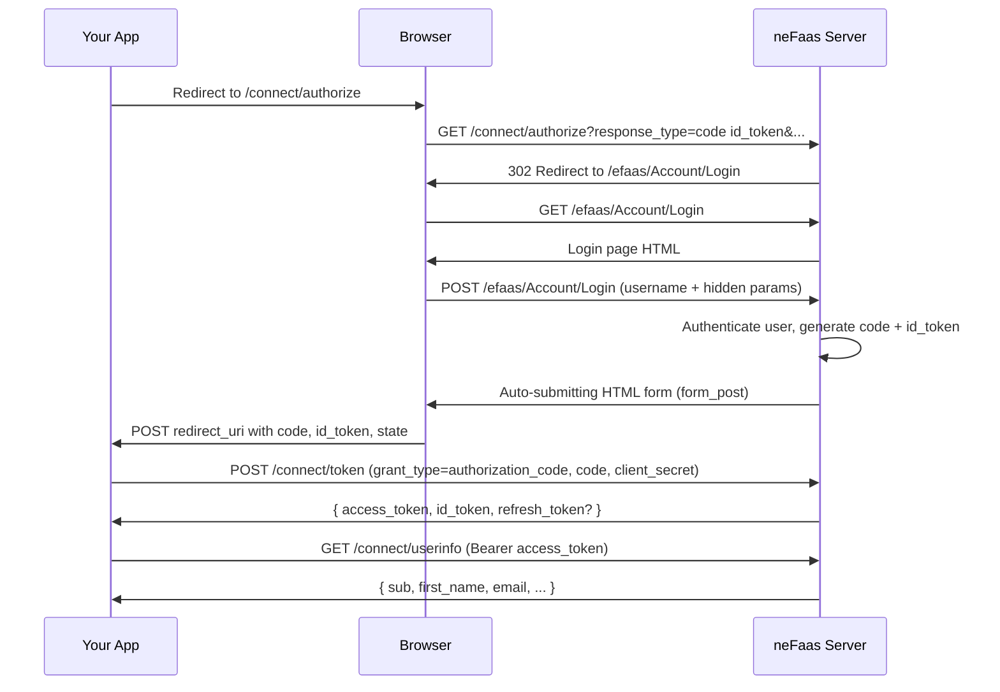
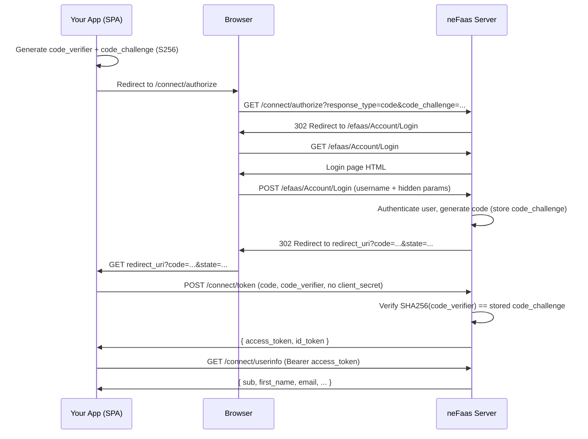
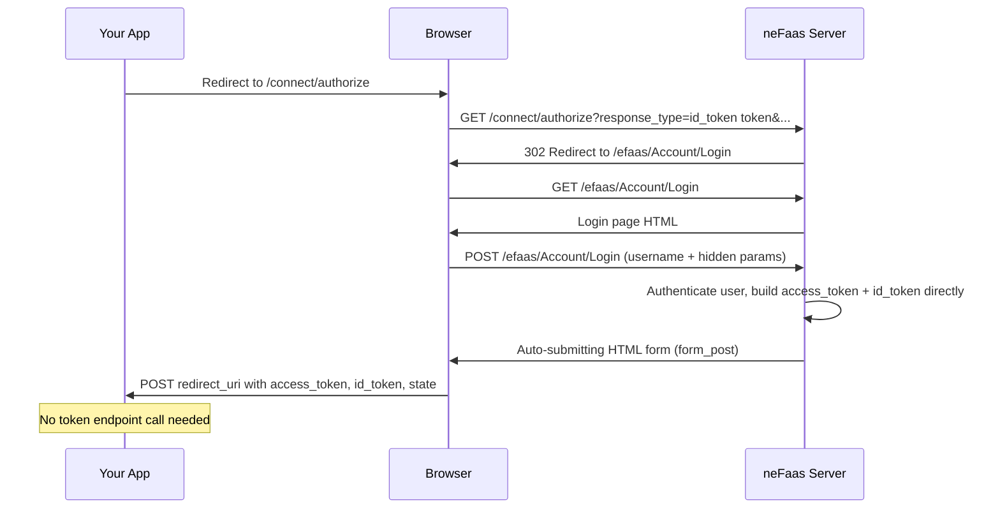
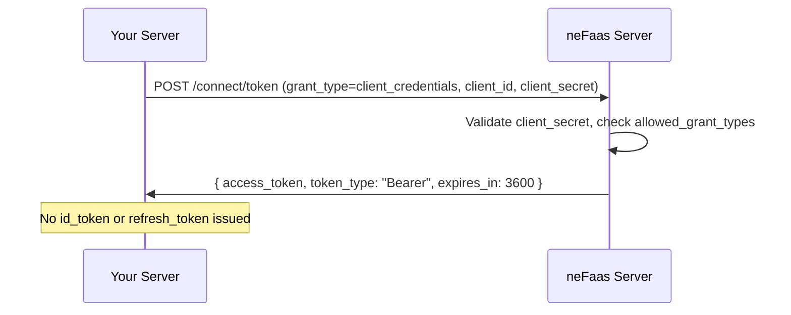
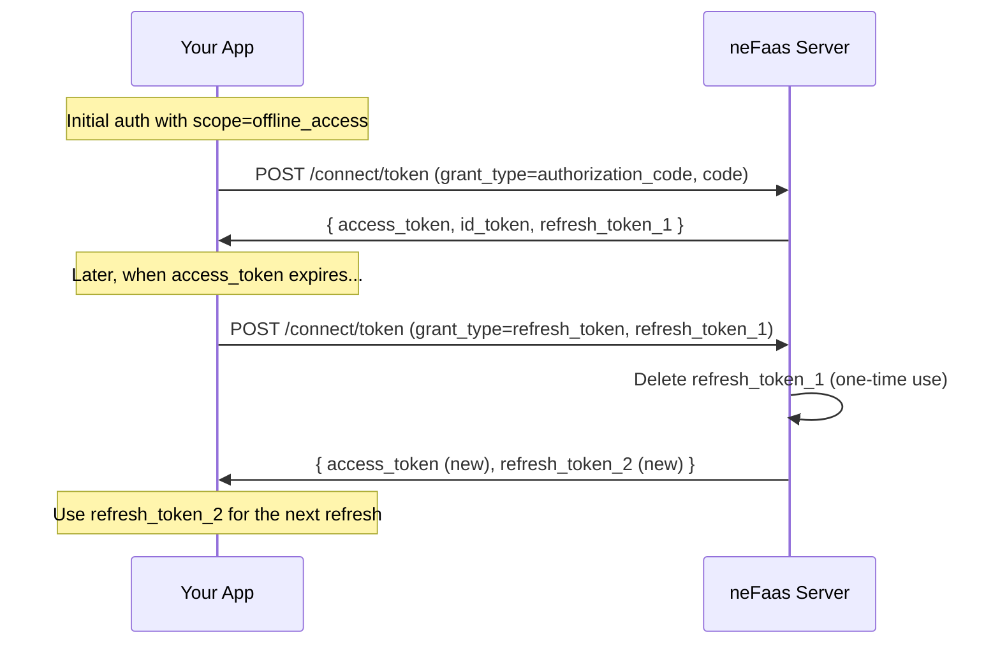
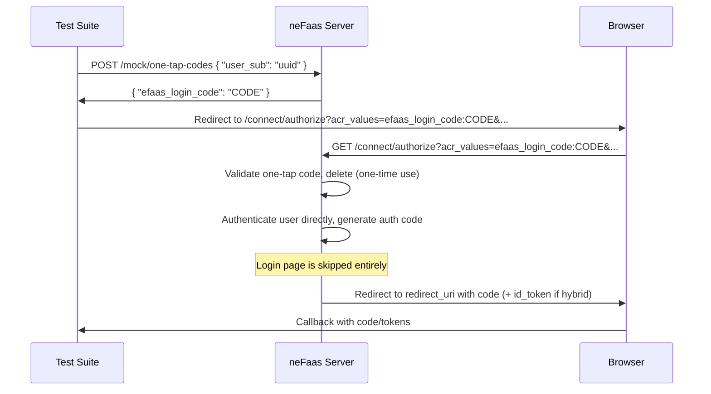
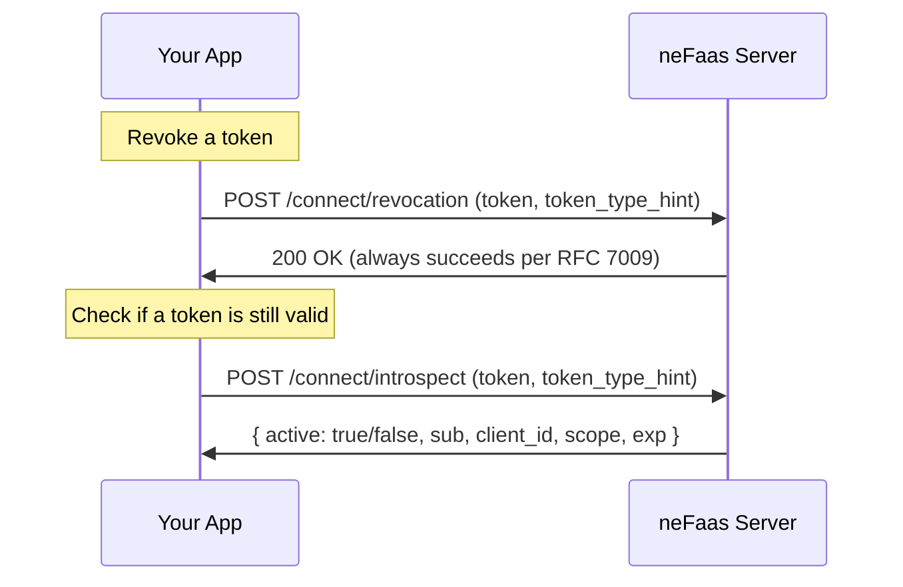
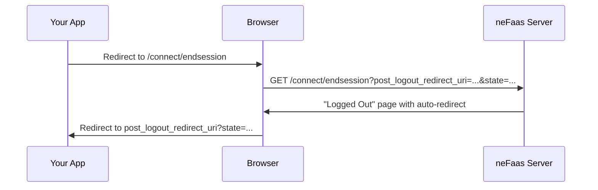

# Authorization Flows

## Hybrid Flow (default eFaas flow for server-side apps)

The hybrid flow is the standard eFaas integration pattern. It uses `response_type=code id_token` with `response_mode=form_post` to deliver both an authorization code and an ID token directly to your server via a POST callback.

```
GET /connect/authorize?
  client_id=YOUR_CLIENT_ID&
  redirect_uri=https://yourapp.com/callback&
  response_type=code id_token&
  response_mode=form_post&
  scope=openid efaas.profile efaas.email&
  nonce=RANDOM_NONCE&
  state=RANDOM_STATE
```



The hybrid flow delivers the `id_token` immediately in the callback, so your app can verify the user's identity without a round-trip to the token endpoint. The `code` can then be exchanged for an `access_token` to call the userinfo endpoint.

## Authorization Code Flow + PKCE (SPAs, mobile apps)

The pure authorization code flow with PKCE is recommended for public clients (SPAs, mobile apps) that cannot securely store a client secret.

```
GET /connect/authorize?
  client_id=YOUR_CLIENT_ID&
  redirect_uri=https://yourapp.com/callback&
  response_type=code&
  scope=openid efaas.profile&
  state=RANDOM_STATE&
  code_challenge=BASE64URL_SHA256_HASH&
  code_challenge_method=S256
```



PKCE replaces the client secret: the `code_verifier` proves that the same client that initiated the flow is exchanging the code.

## Implicit Flow (legacy)

Tokens are returned directly from the authorization endpoint with no code exchange step. Supported for backwards compatibility but not recommended.

```
GET /connect/authorize?
  response_type=id_token token&
  response_mode=form_post&
  ...
```



Supported `response_type` values: `token`, `id_token`, `id_token token`.

## Client Credentials Flow (machine-to-machine)

For server-to-server authentication where no user is involved. Requires a registered client with `client_credentials` in its `allowed_grant_types`.



Register a client first via the mock admin API:

```bash
curl -X POST http://localhost:36445/mock/clients \
  -H "Content-Type: application/json" \
  -d '{"client_id":"my-service","client_secret":"secret","allowed_grant_types":["client_credentials"]}'
```

## Refresh Token Flow

Request the `offline_access` scope to receive a refresh token. neFaas uses **token rotation** — each refresh issues a new refresh token and invalidates the old one.



```bash
curl -X POST http://localhost:36445/connect/token \
  -d "grant_type=refresh_token&refresh_token=REFRESH_TOKEN&client_id=YOUR_CLIENT_ID"
```

## One-Tap Login Flow (headless testing)

A mock-only flow for automated testing that bypasses the login UI. Generate a one-tap code, then pass it via `acr_values` to skip the login page entirely.



## UserInfo

```bash
curl http://localhost:36445/connect/userinfo \
  -H "Authorization: Bearer ACCESS_TOKEN"
```

Returns claims filtered by the scopes granted during authorization.

## Token Revocation & Introspection



## End Session (Logout)


